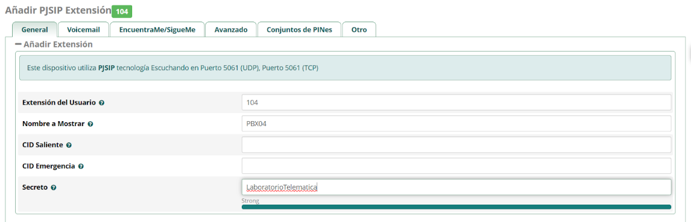
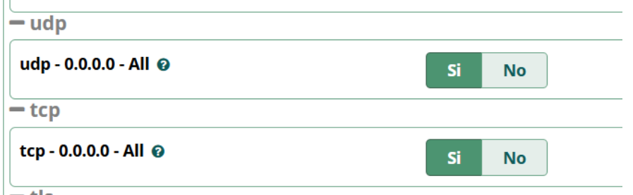
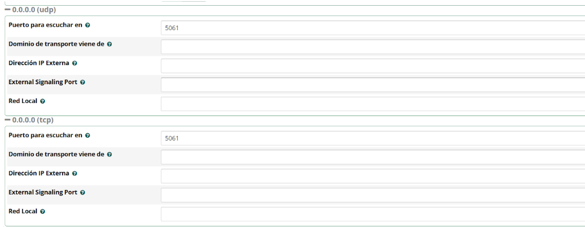
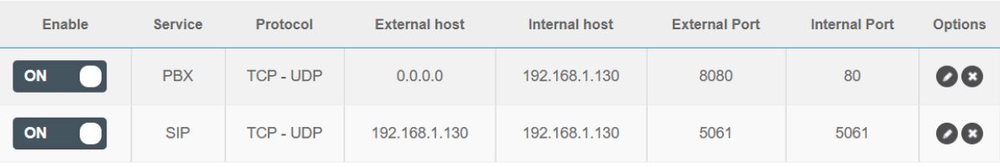
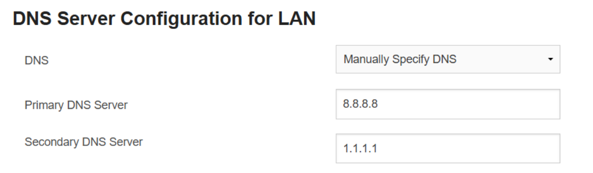
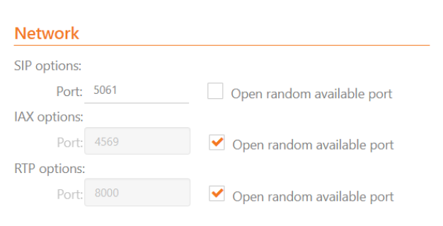
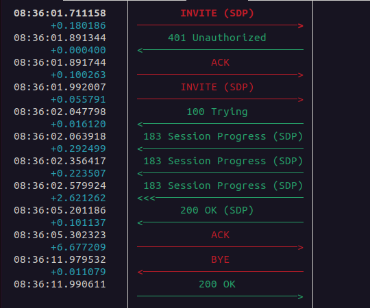

# Creación de un Servicio VOIP
### Curso 4º GITT Asignatura Laboratorio Telemática

En esta primera práctica de la asignatura Laboratorio de Telemática se nos pidió realizar el despliegue de una red VoIP accesible desde Internet basándonos en DDNS

## Capacidades adquiridas y/o reforzadas

- Capacidad de configuración y puesta en marcha operativa de encaminadores y otros
elementos de interconexión.
- Capacidad para diseñar, desplegar y mantener las redes empresariales, tanto a nivel de
intranet/extranet como de su conexión a Internet.
- Capacidad para instalar, configurar y mantener los servicios más importantes de
Internet, incluyendo servicios web, de correo electrónico, noticias, mensajería y otros.
- Ser capaz de seleccionar, diseñar, desplegar, integrar y gestionar redes e
infraestructuras de comunicaciones en una organización.

## Objetivos

- Despliegue real de un servicio de PBX virtual con acceso público desde Internet mediante DDNS.

## Servicios ofrecidos

- Servidor FreePBX (softswitch) sobre una máquina virtual en Virtual Box. Dar de alta tres líneas para tres clientes de VoIP.
- Realización de llamadas VoIP con cada softphone a través de Internet y DDNS.
- Dominio DDNS personalizado.
 
## Topología implementada

## Software utilizado

Para la realización de esta práctica se utilizó:
- VirtualBox para albergar el servidor FreePBX.
- FreePBX.
- Zoiper.
- Wireshark.
- PuTTY.
- SNGrep.

## Hardware utilizado

- Host anfitrión.
- Router FTTH.
- Dispositivos clientes con el softphone instalado.

## Instalación y Configuración FreePBX

### Especificaciones Máquina Virtual

1. Configuraremos los recursos que le daremos a la MV, en este caso será necesario reservar por lo menos 3 GB de memoria RAM y 20 GB de disdo duro para que no de ningún fallo.
   

2. Configuración del adaptador de red para poder realizar la conexión a Internet.
   

### Especificaciones FreePBX

Una vez que hemos realizado la instalación de la máquina virtual, se le ha asignado una contraseña y reiniciado la máquina **(¡IMPORTANTE CUANDO SE REALICE EL REINICIO DESMONTAR LA UNIDAD ÓPTICA PARA QUE NO DE FALLOS!)** podremos configurar el archivo de configuración de la interfaz Eth0. Para ello accedemos al documento:

~~~
sudo nano /etc/sysconfig/network-scripst/ifcfg-eth0
~~~

Donde realizaremos la siguiente configuración:
1. Estableceremos el **BOOTPROTO** de *DHCP* a *Static* para que la IP asignada se mantenga.
2. Añadiremos los apartados:
    ~~~
    IPADDR="<IP LIBRE DE TU ROUTER>"
    GATEWAY=<LA GATEWAY DE TU ORDENADOR>
    ~~~

Tras haber realizado la configuración mostrada reiniciaremos la red con:

~~~
sudo /etc/init.d/network restart
~~~

### FreePBX Web Interface
Tras haber reiniciado la red con el comando anterior **Y EL ROUTER** para aplicar la configuración que hemos realizado podremos acceder a la Web Interface de FreePBX, accediendo a través de la dirección IP que hemos establecido en nuestro documento anterior. Tras realizar las configuraciones iniciales podremos configurar las extensiones que se nos pide.

### Configuración de las extensiones

Añadiremos una extensión PjSIP con los siguientes parámetros:

- **Extensión del Usuario** que servirá para marcar en el softphone.
- **Nombre a mostrar** nombre de usuario que aparecerá en la llamada.
- **Secreto** contraseña para realizar la conexión.

### Activación del servicio UDP y TCP

En el apartado de configuración SIP será necesario habilitar manualmente el servicio TCP, ya que de forma nativa únicametente viene activo el servicio UDP 

### Cambio de puerto UDP

Las llamadas SIP suelen utilizar el puerto reservado 5060, pero a la hora de realizar la configuración en el router es posible que no deje configurar el puerto 5060 por capacidades del router *(o simplemente porque al operador no le de la gana dejarte abrir el puerto)* por lo que FreePBX te da la opción de cambiar el puerto a alguno que no esté reservado, en nuestro caso seleccionamos el puerto **5061**.

## Configuración DDNS

Para configurar el servicio DDNS bastará unicamente con acceder a la página web [NoIP.com](https://www.noip.com/) nos registraremos y crearemos el dominio que nosotros queramos.

## Configuración del Router

### Configuración Port Fordwarding

Crearemos las reglas para que el tráfico se redirija de forma manual a los puertos que nosotros le hayamos indicado. Las normas introducidas en nuestro caso son:

- **8080 al puerto 80** para poder acceder a la FreePBX de forma remota.
- **5061 al puerto 5061** para poder realizar la llamada correctamente.

### Configuración manual DNS

En nuestro caso también se tuvo que realizar la configuración manual del servidor DNS *(ojalá supiéramos por qué pero bueno funcionó)* 

### Configuración DDNS

Para terminar de configurar nuestro servicio DDNS nos iremos al apartado **DynDNS** de nuestro router y en él realizaremos la configuración que nos indique nuestro router.

## Configuración Zoiper

El registro del cliente en Zoiper es algo bastante intuitivo, pero si que es necesario indicar que a la hora de hacer el registro será necesario especificar el puerto para que se vea forzado a realizar el envío de tramas por ahí. Para especificar el puerto se puede hacer de fos formas:

1. Indicándolo en el **registro**.
~~~
<extension>@<nombredeldominio>:<puerto>
~~~

Por ejemplo

~~~
101@servidorddns.ddns.net:5061
~~~

2. "Abriendo" el puerto manualmente en la configuración.

En todo caso bastará con teclear la extensión si queremos llamar a un perfil de nuestra misma red que se haya registrado en otro dispositivo, mientras que si queremos llamar a otro dominio será necesario además indicar el protocolo **SIP**

~~~
sip:<extension>@<nombredeldominio>:<puerto>
~~~

Por ejemplo

~~~
sip:121@otroservidor.ddns.net:5061
~~~

## Verificación de servicios
### SNGrep

Como vemos en la gráfica mostrada el flujo de mensajes es el correcto. Es importante destacar que primero se manda un mensaje del tipo *Unauthorized* para después realizar la autenticación. Esto es debido a que según el estándar [RFC 3261](https://datatracker.ietf.org/doc/html/rfc3261#page-185) se debe hacer un challenge para después poder realizar la configuración.
